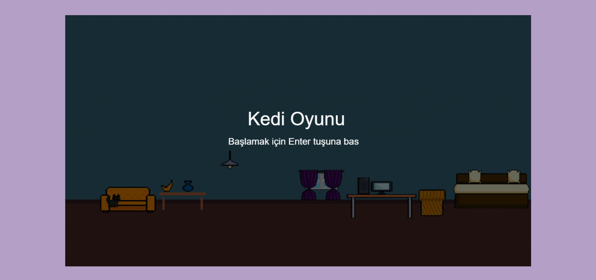
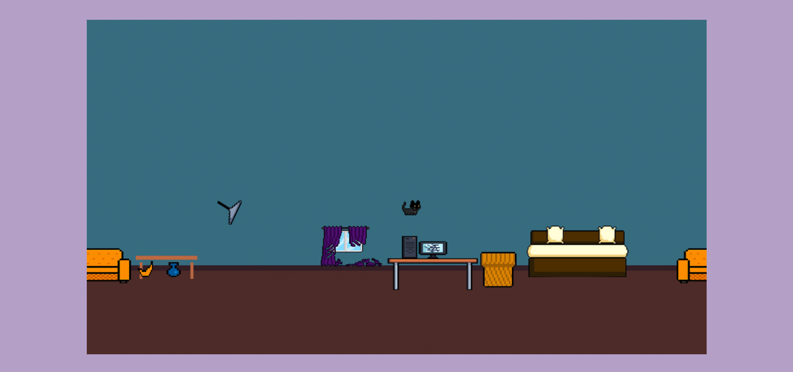

<<<<<<< HEAD
# Kedi Oyunu 🐱

Bu proje, JavaScript ve HTML5 Canvas kullanılarak geliştirilmiş basit bir 2D kedi oyunudur. Oyunda kullanıcı, bir kedi karakterini yönlendirerek çeşitli nesnelerle etkileşim kurar ve yaramazlık yapar. Yaramazlık sonucunda bir köpek tarafından kovalanır. Amaç, olabildiğince uzun süre hayatta kalmaktır.

## 🎮 Oynanış

- **A / D tuşları:** Sola / sağa hareket
- **W veya Space:** Zıplama
- **F tuşu:** Eşya ile etkileşim (yaramazlık)
- **Enter:** Oyunu başlat
- Etkileşim sonrası köpek kovalaması başlar ve temas halinde oyun biter.

## 📸 Oyun İçi Görseller

### Oyun Başlangıç Ekranı

### Oyun Sırasında Etkileşim

## 🔊 Özellikler

- Ses efektleri (cam kırılma, çizilme, havlama)
- Arka plan müziği
- Basit fizik motoru
- Sprite tabanlı animasyon
- Arka plan kaydırma
- GitHub Pages üzerinden yayında

## 🔗 Canlı Demo

Oyunu buradan oynayabilirsiniz:  
👉 [https://guldemirel.github.io/kedi-oyunu](https://guldemirel.github.io/kedi-oyunu)

## 👩‍💻 Geliştirici

**Sümeyye Gül Demirel**  
Bursa Teknik Üniversitesi – Bilgisayar Mühendisliği

=======
>>>>>>> 95981761224cc7e563e5b92430445075ea9626f1

